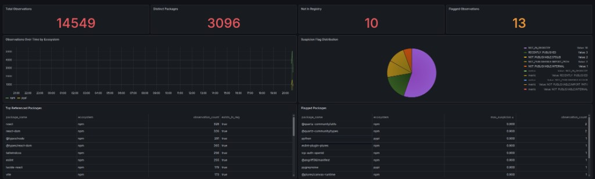
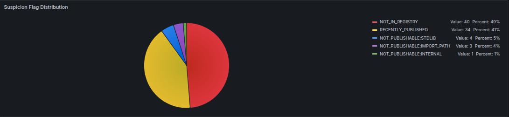
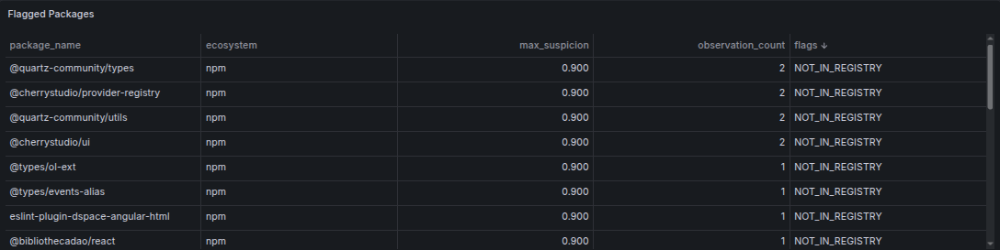
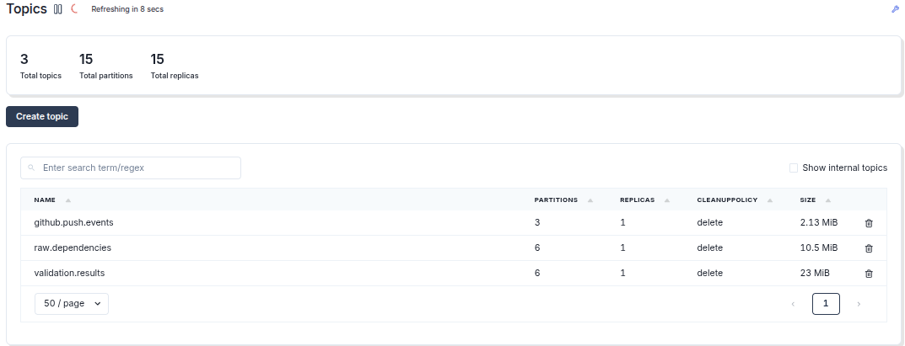
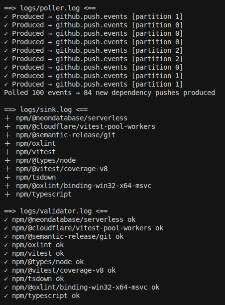

# Dependency Churn & Package Hallucination Tracker

A real-time streaming pipeline that ingests public GitHub push events, extracts the
package dependencies they touch (`package.json`, `requirements.txt`), and cross-references
every package against the live **npm** and **PyPI** registries to flag packages that are
**hallucinated** (don't exist), **suspiciously new**, or **likely typosquats**.

The motivating question: **how often do LLM-generated commits reference non-existent or
malicious packages?** As AI coding assistants get more common, "package hallucination"
becomes an attack surface — attackers register the fake names LLMs invent. This pipeline
detects that drift in real time.



---

## Architecture

```
            GitHub Public Events API
                      │
                      ▼
        ┌──────────────────────────┐
        │  github-poller (producer)│   polls events, dedupes via Redis
        └──────────────────────────┘
                      │  topic: github.push.events
                      ▼
        ┌──────────────────────────┐
        │  commit_parser (consumer)│   fetches files @ commit SHA,
        │                          │   parses deps (Redis-cached)
        └──────────────────────────┘
                      │  topic: raw.dependencies
                      ▼
        ┌──────────────────────────┐
        │ registry_validator       │   checks npm / PyPI,
        │ (consumer)               │   scores suspicion (Redis-cached)
        └──────────────────────────┘
                      │  topic: validation.results
                      ▼
        ┌──────────────────────────┐
        │  sink_consumer (consumer)│   idempotent upserts
        └──────────────────────────┘
                      │
                      ▼
                 PostgreSQL  ◄────────  Grafana dashboards
```

Every stage is decoupled through Kafka topics, so each can be scaled, restarted, or
replaced independently.

---

## Screenshots

**Dashboard — hallucination metrics, flag distribution, and flagged packages:**


**Suspicion flag distribution (color-coded by signal type):**



**Flagged packages — real hallucinations caught (e.g. `@cherrystudio/ui`, `vite7`):**



**Kafka topics carrying the pipeline (Redpanda Console):**



**Pipeline running end-to-end (`make logs`):**



---

## Tech Stack

| Layer | Technology |
|---|---|
| Message broker | Apache Kafka (KRaft mode, no Zookeeper) |
| Stream producers/consumers | Python + `confluent-kafka` |
| Ingestion source | GitHub Public Events API (`httpx`) |
| Cache | Redis (dedupe + registry/file response caching) |
| Storage | PostgreSQL |
| Visualization | Grafana (provisioned as code) |
| Kafka UI | Redpanda Console |
| Orchestration | Docker Compose + Makefile |

---

## Prerequisites

- Docker + Docker Compose v2
- Python 3.10+
- A GitHub Personal Access Token (classic, `public_repo` scope is enough)

---

## Setup

**1. Create a virtual environment and install dependencies**

```bash
python -m venv .venv
source .venv/bin/activate
pip install -r requirements.txt
```

> The `Makefile` expects the venv at `../.venv` by default. Override with
> `make <target> PYTHON=/path/to/python` if yours lives elsewhere.

**2. Create your `.env`**

```bash
KAFKA_BOOTSTRAP_SERVERS=localhost:9092
REDIS_HOST=localhost
REDIS_PORT=6379
GITHUB_TOKEN=ghp_your_token_here
GITHUB_POLL_INTERVAL_SECONDS=60
PG_HOST=localhost
PG_PORT=5434
PG_USER=deptracker
PG_PASSWORD=deptracker
PG_DB=deptracker
```

> `.env` is git-ignored — never commit your token.

**3. Bring up the entire stack**

```bash
make start
```

This starts Docker services, waits for Kafka, creates topics, and launches all four
Python services in the background.

---

## Make Targets

| Command | Description |
|---|---|
| `make start` | Full stack: infra + topics + all services |
| `make up` / `make down` | Start / stop Docker services (data preserved) |
| `make clean` | Stop services **and delete data volumes** |
| `make topics` | Create Kafka topics (waits for Kafka health) |
| `make smoke` | Produce/consume smoke test |
| `make pipeline` | Launch the 4 Python services in the background |
| `make stop` | Stop the background services |
| `make restart` | `stop` + `pipeline` |
| `make logs` | Tail all service logs |
| `make poller` / `parser` / `validator` / `sink` | Run one service in the foreground (debugging) |
| `make ps` | Container status |

---

## Service Endpoints

| Service | URL |
|---|---|
| Grafana | http://localhost:3000 (admin / admin) |
| Kafka UI (Redpanda Console) | http://localhost:8080 |
| PostgreSQL | localhost:5434 |
| Redis | localhost:6379 |

---

## Project Layout

```
dependency-tracker/
├── docker-compose.yml          # kafka, redis, kafka-ui, postgres, grafana
├── Makefile                    # one-command operations
├── requirements.txt
├── .env                        # local config (git-ignored)
│
├── infra/
│   ├── create_topics.py        # creates the 3 Kafka topics
│   ├── smoke_test.py           # produce/consume sanity check
│   └── schema.sql              # Postgres tables (auto-applied by sink)
│
├── services/
│   └── github-poller/
│       └── poller.py           # produces github.push.events
│
├── consumers/
│   ├── commit_parser.py        # github.push.events -> raw.dependencies
│   ├── registry_validator.py   # raw.dependencies   -> validation.results
│   └── sink_consumer.py        # validation.results -> PostgreSQL
│
├── lib/
│   ├── parsers.py              # package.json / requirements.txt parsing
│   └── registry_client.py      # npm + PyPI lookups, typosquat detection
│
└── grafana/
    ├── provisioning/           # datasource + dashboard providers
    └── dashboards/             # dashboard JSON
```

---

## Data Model

**`dependency_observations`** — one row per (repo, commit, package):

| Column | Notes |
|---|---|
| `repo`, `commit_sha`, `ecosystem`, `package_name` | composite uniqueness |
| `version_spec` | declared version constraint |
| `exists_in_reg` | `false` = hallucinated / removed |
| `suspicion_score` | 0–1 heuristic score |
| `flags` | JSONB array of signal flags |
| `validated_at` | timestamp |

A `UNIQUE (repo, commit_sha, ecosystem, package_name)` constraint makes the sink
**idempotent** under Kafka's at-least-once delivery.

**`packages`** — canonical per-package aggregate (`observation_count`, `max_suspicion`,
`first_published`, `last_seen`).

---

## Suspicion Signals

Suspicious packages (score > 0):

| Flag | Meaning | Score |
|---|---|---|
| `NOT_IN_REGISTRY` | Genuinely hallucinated — absent from the registry and not explainable as stdlib/import-path/internal | 0.9 |
| `TYPOSQUAT_CANDIDATE:<target>` | Edit-distance ≤ 2 from a popular package, *and* not an established package | 0.8 |
| `RECENTLY_PUBLISHED` | First published within the last 30 days | 0.5 |

Informational flags (score 0) — packages that are absent from the registry for a
**legitimate** reason, so they are *not* counted as hallucinations:

| Flag | Meaning |
|---|---|
| `NOT_PUBLISHABLE:STDLIB` | A language built-in (e.g. Python's `os`, `re`, `sqlite3`) — never on PyPI |
| `NOT_PUBLISHABLE:IMPORT_PATH` | A dotted import path (e.g. `urllib.parse`), not an installable package name |
| `NOT_PUBLISHABLE:INTERNAL` | A monorepo-internal workspace package (e.g. `@repo/*`) that never publishes publicly |

Two heuristics keep the signal trustworthy:

- **Typosquat detection** is deliberately conservative — it ignores popular target
  names shorter than 5 characters, only allows distance-2 matches for longer targets
  (≥ 7 chars), and only fires for non-existent or newly-published packages (so an
  established package near a popular name — e.g. `sympy` vs `numpy` — is **not** flagged).
- **Hallucination classification** separates a true hallucination from an expected
  absence. A missing package is only flagged `NOT_IN_REGISTRY` if it isn't stdlib, an
  import path, or an internal workspace package. This keeps the headline "hallucination
  rate" metric clean (the `NOT_PUBLISHABLE:*` packages are recorded but scored 0).

---

## Design Decisions

- **Producer stays dumb, consumer does the work.** The poller emits *all* push events;
  detecting which commits actually touch dependency files happens downstream in the
  parser (the Events API doesn't include file lists). This keeps the producer cheap and
  rate-limit friendly.
- **Redis caching at two layers.** The parser caches file lookups by `repo+sha+path`
  (including 404s, via a sentinel) and the validator caches registry responses. This cuts
  GitHub/registry API calls by the majority once the cache warms up.
- **Idempotent sink.** `INSERT ... ON CONFLICT DO NOTHING RETURNING id` ensures
  redelivered Kafka messages never inflate counts.
- **Grafana as code.** Datasource and dashboards are provisioned from files, so the
  dashboards exist immediately on a fresh `make start` and survive restarts.

---

## Example Queries

**Hallucination rate by ecosystem over time:**

```sql
SELECT date_trunc('hour', validated_at) AS time, ecosystem,
       100.0 * COUNT(*) FILTER (WHERE exists_in_reg = false) / COUNT(*) AS hallucination_pct
FROM dependency_observations
GROUP BY 1, 2 ORDER BY 1;
```

**Most-referenced non-existent packages:**

```sql
SELECT package_name, ecosystem, observation_count
FROM packages
WHERE exists_in_reg = false
ORDER BY observation_count DESC
LIMIT 20;
```

---

## Possible Extensions

- Ingest from lower-reputation / AI-generated repos to surface real hallucinations
- Train an ML model (e.g. with MLflow) to replace the hand-tuned suspicion score
- Cross-reference against known-malicious datasets (OSV, Snyk)
- Move storage to a columnar store (ClickHouse / Delta Lake) for large-scale analytics
- Promote the local stack to managed cloud infra (MSK, ECS, Terraform)
